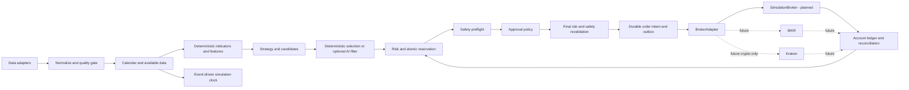

# Architecture

Status: design baseline, 2026-09-13. See [governance](../../PROJECT_RULES.md) and [[01 - Architecture/System Components]] for ownership and contracts.

Use a modular Python monolith initially: one fenced writer per funding account, a deterministic domain core and adapters around it. PostgreSQL is the intended durable store. FastAPI is the future application boundary; Next.js/TypeScript/Tailwind and TradingView Lightweight Charts are future presentation choices. pandas/NumPy may compute features, but do not own time or order semantics. pytest is the intended Python test tool. None is installed or integrated by this pass.

Arrows show runtime data flow, not import dependencies. Import direction is outer adapters/API → application services → domain types and ports. The core imports no Alpaca SDK, database, web framework or AI provider. Ports live inside the boundary, adapters implement them; composition chooses adapters. Ledger, risk and execution communicate through domain records/orchestration rather than circular module imports.

Backtesting is hybrid: vectorized, causally checked features plus an event-driven portfolio/execution loop. Paper and backtest share strategy, risk, order-intent contracts and accounting; execution and clocks differ. API/dashboard read projections and submit authenticated commands to application services, never write broker orders directly.

Deterministic: normalization under pinned rules, calendar lookup, indicators, features, strategy, risk, accounting, state transitions, metrics, selection tie-breaks and seeded simulation replay. Probabilistic: optional AI and explicitly seeded stress execution models. Actual broker/network behavior is external, observed and recorded, not reproducible by assumption.

Use immutable run manifests and append-only decision/fill events; rebuildable projections avoid a full event-sourced platform for every table. Domain records carry agent, allocation, account, data/run mode, execution environment, submission mode, approval policy, operating context, strategy, model, management, performance-kind and experiment/run IDs. This leaves room for more users/providers later without implementing SaaS tenancy, subscriptions or distributed services now.

Critical ordering and invariants live in [[01 - Architecture/Market Data]], [[06 - Testing/Backtesting]], [[01 - Architecture/Risk Engine]], [[01 - Architecture/Execution/Order Lifecycle]] and [[01 - Architecture/AI Architecture]]. [[10 - Archive/Reviews/Architecture Review]] maps the 25 design questions to decisions and blockers.

## Concurrent participants

[[01 - Architecture/Agent Architecture]] isolates trading participants while sharing immutable data. [[01 - Architecture/Portfolio Accounting/Capital Allocation]] partitions funding without double allocation; four EUR50 simulations default to independent ledgers/accounts. Agent locks remain local; parent-account/system failures propagate to their actual scope. Shared broker attribution is capability-gated.

[[01 - Architecture/Execution/Execution Modes]] separates data/run mode, execution environment, submission mode, approval policy and NORMAL/EXPERIMENT context. Consent binds immutable proposals; FULL_AUTO removes only the click and never implies LIVE. [[01 - Architecture/Execution/Safety Gate]] and [[01 - Architecture/Execution/Approval Workflow]] govern every submission. [[01 - Architecture/Execution/Trade Management]] retains fixed exits as baseline. [[03 - Experiments/Autonomous Experiments]], [[09 - Performance/Agent Statistics]] and [[03 - Experiments/Survival Analysis]] define comparisons; [[09 - Performance/Reporting Architecture]] remains specification only.
